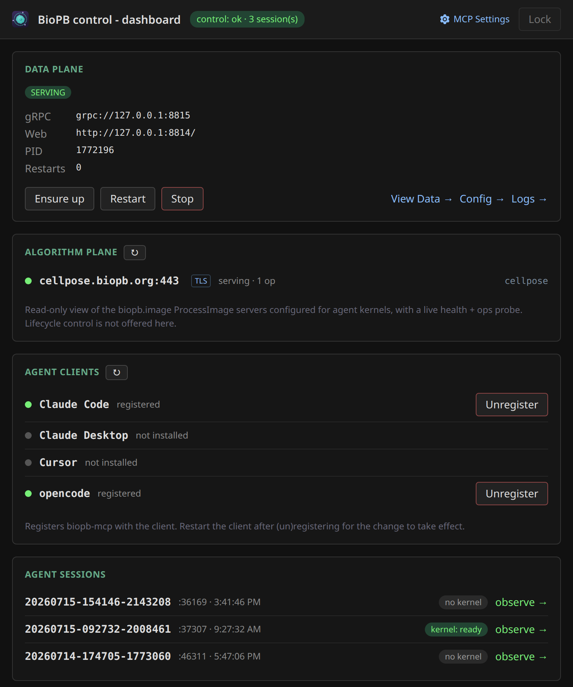

# Working with the dashboard

The **dashboard** shows you all sub-components of biopb, and allows you to:

- [**observe your agent**](#watching-your-agent): lets *you* watch what the agent runs, step in when something goes
wrong, and save the whole session as a notebook for the record.
- [**change biopb settings**](#changing-biopb-settings): edit/rewrite the config file of biopb or restart the data server
with a new configuration
- [**view data**](#viewing-your-data): see your microscopy data via a web interface without connecting to an agent
or start napari

## Opening it

Open `biopb dashboard` like any other app on your desktop, or, if you are a terminal user, run 
`biopb dashboard` in your terminal

## What's on it

Four panels, each covering one piece of the system.

<figure markdown>
  
  <figcaption>The dashboard: the data plane and its controls, the algorithm servers your agent can reach, which agents biopb is registered with, and every live session with a link to watch it.</figcaption>
</figure>

- **Data plane** — your [data server](data-servers.md)'s health and the buttons that drive it.
  **Ensure up** starts it if it isn't running (harmless if it already is), **Restart** bounces
  it, and **Stop** leaves clients without data until something asks for it again. **Logs →**
  opens its output, so you don't have to go digging through files.
- **Algorithm plane** — the [algorithm servers](algorithm-servers.md) your agent can reach,
  with a live health probe. Read-only: algorithm servers are started and stopped where they
  run, usually a GPU box or a container, not from here.
- **Agent clients** — register or unregister biopb with each agent; the same job as
  `biopb agents register`. Agents you don't have are listed as *not installed* and left alone.
  **Restart the client afterwards**, or it won't pick up the change.
- **Agent sessions** — every live session, its kernel state, and an **observe →** link. Each
  session is one agent's *own* viewer and kernel, so two agents means two rows here, not one
  shared session.

## Watching your agent

An agent is a powerful but opaque collaborator. It writes and runs real Python on your
machine — segmentations, measurements, file reads — and most of the time you only see
the results, not the work. The observe view closes that gap. It exists so you can:

- **See what's actually running.** Every `execute_code` job shows up with its source and
  its captured output, newest first — so "what did the agent just do?" is always one
  glance away.
- **Step in.** If a job hangs or heads in the wrong direction, you can interrupt that
  one job or hard-restart the whole kernel — without killing the conversation.
- **Keep a record.** One click exports the entire session as a Jupyter notebook: an
  **audit trail** of every command the agent ran and what came back (see
  [Saving a notebook (audit)](#saving-a-notebook-audit) below).

This is the same idea as the [shared canvas in napari](using-napari.md) — you and the
agent work over one session — applied to the *code* the agent runs rather than the
*images* it produces.

<figure markdown>
  
  <figcaption>The observe view: recent <code>execute_code</code> jobs, newest first, with the kernel status and controls in the header.</figcaption>
</figure>

### Opening a session's view

Each agent session gets its own observe view. Open the dashboard and click the session you
want under **Agent sessions**; that takes you to `/session/<session-id>/observe`.

There's no fixed URL to bookmark: every session runs on its own dynamically assigned port,
and the control plane is what knows where each one lives. Going through the dashboard is how
you find them. You can also ask your agent to run **`server_status`**, which reports the
observe URL for its own session.

### Reading the job list

Each row is one job the agent ran, with a status badge:

| Badge | Meaning |
|-------|---------|
| **running** | The job is executing right now. |
| **ok** | Finished successfully. |
| **error** | Raised an exception (the traceback is in the output). |
| **cancelled** | Stopped by the agent. |
| **interrupted** | Stopped by *you* from this page. |

Click a row to expand it and see the **code** that was run and its **output**. The
newest job stays expanded automatically; older jobs collapse so the page doesn't get
noisy. For a running job the output tails live as it's produced (long output is
truncated to the most recent chunk, with the full length noted). The header shows the
kernel state — `alive`, `busy`, `headless` — and refreshes every few seconds.

### Stepping in

Three controls live in the header:

- **Interrupt** — forces a `KeyboardInterrupt` into the *currently running* job. Use
  this when a single command is stuck (a runaway loop, a stall) but the session is
  otherwise fine. The agent sees, through its normal result, that *a user* stopped the
  job — so it won't mistake the interruption for its own logic failing.
- **Restart kernel** — hard-restarts the Python kernel. This clears **all** variables
  and napari layers, so you're asked to confirm first. Reach for it when the kernel is
  wedged badly enough that interrupting one job isn't enough.
- **⤓ Save notebook** — exports the session (covered next).

!!! tip "Interrupt the job, not the conversation"
    Interrupting or restarting from this page doesn't end your chat with the agent. The
    agent simply gets back a "stopped by user" result and you can tell it what to do
    next.

### Saving a notebook (audit)

The **⤓ Save notebook** button exports the whole recorded session as a standard Jupyter
`.ipynb` file (`biopb-mcp-session-YYYYMMDD-HHMMSS.ipynb`). This is the view's most
important feature for reproducibility and review.

The notebook is an **audit record first, a runnable script second.** It faithfully
reproduces, in order:

- a title and summary cell (when it was exported, how many jobs),
- a **bootstrap cell** that rebuilds the core namespace (`np`, `da`, the data-plane
  `client`, the compute-plane `ops`, and an empty napari `viewer`) on a best-effort
  basis, and
- **one cell per job** — the exact code the agent ran, with its captured stdout,
  results, and any error or interruption message — each headed by its job id, status,
  elapsed time, and timestamp.

That gives you a complete, shareable trail of what was done to your data: drop it next
to your results, attach it to a paper's supplement, or hand it to a colleague to review.

<figure markdown>
  
  <figcaption>The exported notebook: each cell is one job the agent ran, kept verbatim with its output and a header line.</figcaption>
</figure>

!!! warning "Re-running has caveats"
    The notebook is meant to *document* a session, not perfectly replay it. In-namespace
    Python variables carry across cells, but **external state is not captured**:
    tensor-server source ids and the live napari layers from the original session may not
    coincide on a fresh kernel, so cells that chain `ops` source ids or read `viewer` layers
    need the same live server (or hand edits) to run again. Cells marked `error`,
    `cancelled`, or `interrupted` are kept verbatim — re-running one may re-trigger the
    same failure, so skip or edit it. Only the most recent jobs are retained, so a very
    long session may be missing its earliest steps.

## Changing biopb settings

biopb keeps two [config files](configuration.md), and the dashboard gives each one an editor
so you don't have to hand-edit JSON:

- **Config →**, on the data plane panel, edits the **data server**'s settings — where your
  data lives, the cache, the ports. This is `biopb.json`.
- **MCP Settings**, at the top right, edits **biopb-mcp**'s settings — the kernel, dask, and
  the algorithm servers your agent can reach. This is `mcp-config.json`.

Both work the same way: change a value, then **Save**. The page tells you when you have
unsaved changes, and refuses a value it can't accept rather than writing a broken file.

The data server reads its config at startup, so changes there take effect on the next
**Restart** — the editor offers one, and the data plane panel has the same button. Editing
settings won't silently restart anything under your agent.

!!! tip "The same values, either way"
    These editors and the config files are two doors onto the same settings. If you'd rather
    edit the files directly, [Configuration](configuration.md) documents the keys and where
    the files live.

## Viewing your data

**View Data →**, on the data plane panel, opens biopb's web viewer. It lists the sources your
data server is serving and lets you open and page through them in the browser.

It's the quickest way to check that your data is where you think it is, and what's actually in
it — no agent, no napari, no waiting for a kernel to boot. The server renders the slice you're
looking at and sends back just that picture, so even a dataset far larger than your machine
opens immediately and your browser never downloads the pixels.

For real work — layers, editing, plugins, and a canvas you share with your agent — use
[napari](using-napari.md) instead.
