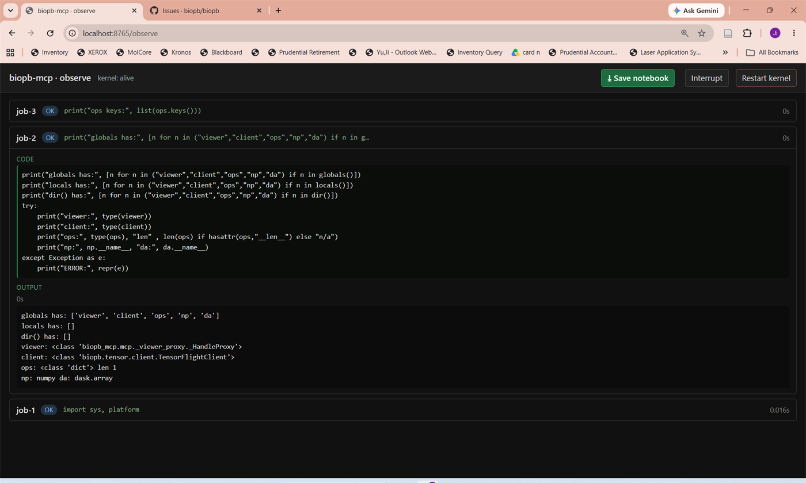
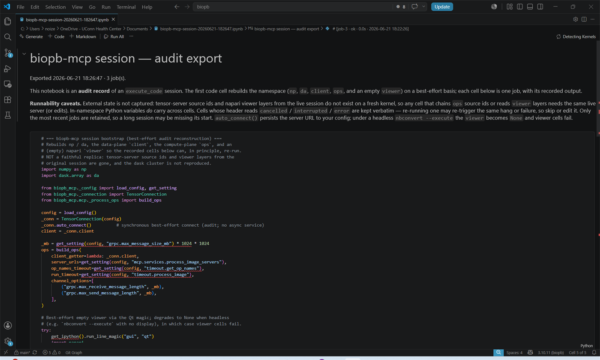

# Working with the dashboard

The **dashboard** is biopb's one web page. It's where you see what your agent is running,
check that your data server is healthy, browse your images, and connect biopb to a new agent
— all from a single address.

It's served by the [control plane](concepts.md#the-control-plane), which is also what keeps
your data server alive. You never have to open it to get work done: the dashboard is a window
onto the machinery, not a step in the workflow.

## Opening it

```bash
biopb dashboard
```

That makes sure the control plane is running and opens the page in your browser. It's safe to
run any time — if everything is already up, it just opens the page.

If it's already running, browse straight to it:

```
http://127.0.0.1:8813/
```

!!! note "Local by default"
    On a normal install every listener binds loopback (`127.0.0.1`), and there's no login
    because there's no remote access. If you started the control plane with a token — or with
    `--remote`, which requires one — you'll unlock the dashboard first. See
    [Security](data-servers.md#security).

## What's on it

Four panels, each covering one piece of the system.

### Data plane

The health of your [data server](data-servers.md): a status badge, its gRPC and web
addresses, its process id, and how many times the control plane has had to restart it. If it
last failed, the error is shown here.

Three buttons drive it:

- **Ensure up** — start it if it isn't running. Harmless if it already is.
- **Restart** — bounce it.
- **Stop** — shut it down. Clients lose the data server until something asks for it again.

From here you can also jump to **View Data** (the image viewer) and the server **Admin** page.

### Algorithm plane

A read-only list of the [algorithm servers](algorithm-servers.md) your agent can reach, with
a live health probe and the operations each one offers. If you haven't configured any, it
says so.

This panel only *reports*. Algorithm servers are started and stopped where they run — usually
a GPU box or a container — not from here.

### Agent clients

Which agents biopb is registered with, and a button to register or unregister each one. This
is the same job as `biopb agents register` on the command line.

!!! tip "Restart the agent afterwards"
    A client only picks up the change when it restarts, so quit and reopen Claude Code,
    Cursor, or whichever you just registered.

### Agent sessions

Every live agent session, with its kernel state and a link to watch it. Each session is one
agent's viewer and Python kernel — two agents means two rows here, not one shared session.

Click a session to open its **observe** view, which is the rest of this page.

## Watching your agent

When your agent runs code through biopb, that code executes in a live Python kernel with full
access to your data and viewer. The **observe** view lets *you* watch what the agent runs,
step in when something goes wrong, and save the whole session as a notebook for the record.
It's **on by default**.

### Why it's there

An agent is a powerful but opaque collaborator. It writes and runs real Python on your
machine — segmentations, measurements, file reads — and most of the time you only see
the results, not the work. The observe view closes that gap. It exists so you can:

- **See what's actually running.** Every `execute_code` job shows up with its source and
  its captured output, newest first — so "what did the agent just do?" is always one
  glance away.
- **Step in.** If a job hangs or heads in the wrong direction, you can interrupt that
  one job or hard-restart the whole kernel — without killing the conversation.
- **Keep a record.** One click exports the entire session as a Jupyter notebook: an
  **audit trail** of every command the agent ran and what came back (see
  [Saving a notebook (audit)](#saving-a-notebook-audit) below).

This is the same idea as the [shared canvas in napari](using-napari.md) — you and the
agent work over one session — applied to the *code* the agent runs rather than the
*images* it produces.

<figure markdown>
  
  <figcaption>The observe view: recent <code>execute_code</code> jobs, newest first, with the kernel status and controls in the header.</figcaption>
</figure>

### Opening a session's view

Each agent session gets its own observe view. Open the dashboard and click the session you
want under **Agent sessions**; that takes you to `/session/<session-id>/observe`.

There's no fixed URL to bookmark: every session runs on its own dynamically assigned port,
and the control plane is what knows where each one lives. Going through the dashboard is how
you find them. You can also ask your agent to run **`server_status`**, which reports the
observe URL for its own session.

### Reading the job list

Each row is one job the agent ran, with a status badge:

| Badge | Meaning |
|-------|---------|
| **running** | The job is executing right now. |
| **ok** | Finished successfully. |
| **error** | Raised an exception (the traceback is in the output). |
| **cancelled** | Stopped by the agent. |
| **interrupted** | Stopped by *you* from this page. |

Click a row to expand it and see the **code** that was run and its **output**. The
newest job stays expanded automatically; older jobs collapse so the page doesn't get
noisy. For a running job the output tails live as it's produced (long output is
truncated to the most recent chunk, with the full length noted). The header shows the
kernel state — `alive`, `busy`, `headless` — and refreshes every few seconds.

### Stepping in

Three controls live in the header:

- **Interrupt** — forces a `KeyboardInterrupt` into the *currently running* job. Use
  this when a single command is stuck (a runaway loop, a stall) but the session is
  otherwise fine. The agent sees, through its normal result, that *a user* stopped the
  job — so it won't mistake the interruption for its own logic failing.
- **Restart kernel** — hard-restarts the Python kernel. This clears **all** variables
  and napari layers, so you're asked to confirm first. Reach for it when the kernel is
  wedged badly enough that interrupting one job isn't enough.
- **⤓ Save notebook** — exports the session (covered next).

!!! tip "Interrupt the job, not the conversation"
    Interrupting or restarting from this page doesn't end your chat with the agent. The
    agent simply gets back a "stopped by user" result and you can tell it what to do
    next.

### Saving a notebook (audit)

The **⤓ Save notebook** button exports the whole recorded session as a standard Jupyter
`.ipynb` file (`biopb-mcp-session-YYYYMMDD-HHMMSS.ipynb`). This is the view's most
important feature for reproducibility and review.

The notebook is an **audit record first, a runnable script second.** It faithfully
reproduces, in order:

- a title and summary cell (when it was exported, how many jobs),
- a **bootstrap cell** that rebuilds the core namespace (`np`, `da`, the data-plane
  `client`, the compute-plane `ops`, and an empty napari `viewer`) on a best-effort
  basis, and
- **one cell per job** — the exact code the agent ran, with its captured stdout,
  results, and any error or interruption message — each headed by its job id, status,
  elapsed time, and timestamp.

That gives you a complete, shareable trail of what was done to your data: drop it next
to your results, attach it to a paper's supplement, or hand it to a colleague to review.

<figure markdown>
  
  <figcaption>The exported notebook: each cell is one job the agent ran, kept verbatim with its output and a header line.</figcaption>
</figure>

!!! warning "Re-running has caveats"
    The notebook is meant to *document* a session, not perfectly replay it. In-namespace
    Python variables carry across cells, but **external state is not captured**:
    tensor-server source ids and the live napari layers from the original session may not
    coincide on a fresh kernel, so cells that chain `ops` source ids or read `viewer` layers
    need the same live server (or hand edits) to run again. Cells marked `error`,
    `cancelled`, or `interrupted` are kept verbatim — re-running one may re-trigger the
    same failure, so skip or edit it. Only the most recent jobs are retained, so a very
    long session may be missing its earliest steps.

### Turning it off

The observe view is on by default. To disable it, set `observe.enabled` to `false`
in your [config file](configuration.md):

```json
{
  "observe": {
    "enabled": false
  }
}
```

Two other knobs under `observe` tune it: `max_output_chars` (how much of a job's
output the detail view shows, default `20000`) and `poll_interval_ms` (how often the
page refreshes, default `3000`).

## The other pages

Everything the control plane serves lives under the same address, so these are all one click
away — and all reachable from the dashboard:

| Page | What it's for |
|------|---------------|
| [`/viewer`](http://127.0.0.1:8813/viewer) | Browse your image data in the web viewer. |
| [`/admin`](http://127.0.0.1:8813/admin) | The data server's admin page — sources, cache, config. |
| [`/logs`](http://127.0.0.1:8813/logs) | The data plane's log output, without digging through files. |
| [`/mcp/admin`](http://127.0.0.1:8813/mcp/admin) | biopb-mcp's settings, the same ones in [`mcp-config.json`](configuration.md). |
