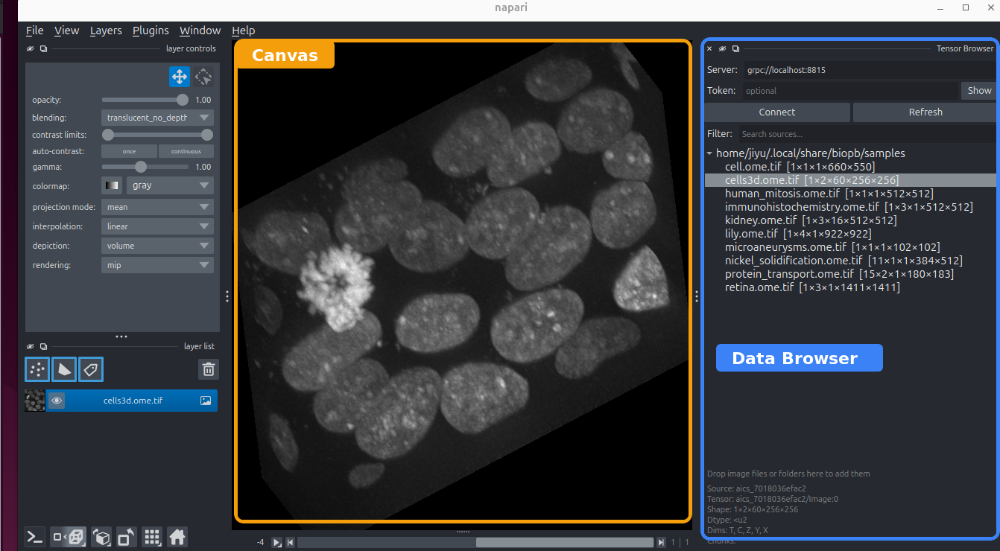

# Working with napari

[napari](https://napari.org) is the viewer where your images and analysis results appear. The
**Data Browser** is a widget that shows up on the right side of your napari window. This widget
(part of `biopb-mcp`) connects napari to a data server so you, and your agent, can browse and
open data.

<figure markdown>
  
  <figcaption>The two areas you'll use most: the <strong>canvas</strong>, where images and results are displayed, and the <strong>Data Browser</strong> on the right, which lists the sources on your data server.</figcaption>
</figure>

## Data Browser

The Data Browser is the workspace where your image data appears. To open a source that's already
listed, **right-click it** and open it as a napari image layer.

Reading data is **lazy**, which means opening a huge multi-dimensional image does not read all
pixels into memory. Instead, data streams in as you scroll through Z, time, or channels, and only
the planes you actually view are fetched.

To add a new dataset, simply **drag a file or folder from your file manager onto the Data
Browser**, and the [data server](data-servers.md) registers it on the spot — no restart. The drop
runs through the same reader pipeline as a watched directory, so you can drop the [same formats the
server reads](data-servers.md#what-it-does).

!!! note
    Only **local** files and folders can be dropped this way. To serve data from a shared store or
    a remote machine, see [Data servers](data-servers.md).

## A shared canvas with your agent

The viewer you're looking at is the **same session your agent drives**. When the agent runs a
segmentation, the result appears as a new layer in front of you. You can:

- adjust contrast, colormaps, and visibility,
- edit labels or draw shapes by hand,
- and ask the agent to read your edits back and keep going.

Image results land here in the viewer; numbers and tables go to the agent's chat. **You**
decide what becomes a saved file — use napari's normal save/export to keep a layer or result.

## Doing things yourself

You don't have to go through the agent for everything. The Data Browser and napari work as
a normal viewer, so you can open data, pan and zoom, and inspect layers directly whenever you
like. The agent is there for the analysis you'd rather describe than click through.

You can go further: run the whole viewer yourself with no agent attached, and extend it with
your own napari plugins.

### Starting the viewer without an agent

Normally your agent starts biopb and brings up napari for you. You can do the same by hand —
useful when you just want to browse data, or when no agent is running.

In a terminal, run:

```bash
biopb mcp view
```

That opens the napari window with the Data Browser attached — the same viewer an agent would
drive, only there's no agent on the other end. It runs in the foreground and keeps going until
you press `Ctrl-C` or close the window.

From here napari is entirely yours: open sources from the Data Browser, edit layers, save
results.

!!! note "This viewer is yours alone"
    Each agent session gets its **own** viewer and kernel, so an agent you start later won't
    attach to this window — it opens its own. `biopb mcp view` is for browsing by hand, not
    for sharing a canvas with an agent.

### Adding your own napari plugins

biopb installs everything into a single, isolated environment (a [`uv`](https://docs.astral.sh/uv/)
tool named `biopb`), so a plugin you `pip install` into your system Python won't be visible to
the viewer. Install it into biopb's own environment instead:

=== "Linux / macOS"

    ```bash
    uv pip install --python "$(uv tool dir)/biopb/bin/python" <napari-plugin>
    ```

=== "Windows (PowerShell)"

    ```powershell
    uv pip install --python "$(uv tool dir)\biopb\Scripts\python.exe" <napari-plugin>
    ```

For example, swap `<napari-plugin>` for `napari-animation`. Then **restart the kernel** so
napari re-scans its plugins — from your session's [observe view](dashboard.md#watching-your-agent) → *Restart
kernel*, or just ask your agent. (If you're running `biopb mcp view`, stop it with `Ctrl-C`
and start it again.) The new plugin appears under napari's **Plugins** menu.

!!! note "Upgrades reset the environment"
    Upgrading or reinstalling biopb re-syncs this environment to biopb's own package list, so
    manually added plugins are dropped. Re-run the `uv pip install` above after an upgrade to
    bring them back.

!!! note "The detection/processing widgets are developer tools"
    The napari that comes with biopb also ships a couple of algorithm widgets. These are useful
    for people who want to test their own deployment of [algorithm servers](algorithm-servers.md) — for
    most users these can be ignored safely.